# 🚢배포

### - AWS ec2, Docker, Jenkins

## ✔링크

[Nginx](#1-nginx)

[SSL 인증서](#1-1-ssl-인증서-적용)

[MySQL](#2-mysql)

[Docker](#3-docker)

[Image](#4-docker-image-만들기)

[CI/CD](#5-cicd-설정하기)

[WebHooks](#6-webhooks)

[OpenVidu](#7-openvidu)

[Redis](#8-redis)

## 1. Nginx

Nginx를 설치한다

```
sudo apt-get install nginx
```

### 1-1. SSL 인증서 적용

Let's Encrypt로부터 무료 SSL 인증서를 발급받기 위해 letsencrypt를 설치한다

```
sudo apt-get install letsencrypt
```

도메인에 알맞게 인증서를 발급 받는다

```
sudo letsencrypt certonly --standalone -d [도메인]
ls /etc/letsencrypt/live/[도메인]
```

파일 생성 후 nginx 설정을 채워준다.

```
sudo vim /etc/nginx/sites-available/[적절한파일명].conf
```

도메인이 *j8a703.p.ssafy.io*인 경우 다음과 같다.

```nginx
server {

  location /{
    proxy_pass http://localhost:3000;
  }

  location /assets/ {
    proxy_pass http://localhost:3000/assets/;
  }

  location /api {
    location /api/member {
      if ($request_method = 'OPTIONS') {
        add_header 'Access-Control-Allow-Origin' '$http_origin';
        add_header 'Access-Control-Allow-Credentials' 'true';
        add_header 'Access-Control-Allow-Methods' 'GET, POST, PUT, DELETE, PATCH, OPTIONS';
        add_header 'Access-Control-Allow-Headers' 'Content-Type, Access-Token';
        return 204;
      }
      proxy_hide_header 'Access-Control-Allow-Origin';
      add_header 'Access-Control-Allow-Origin' '$http_origin' always;
      add_header 'Access-Control-Allow-Credentials' 'true' always;
      add_header 'Access-Control-Expose-Headers' 'Set-Cookie';

      proxy_pass http://localhost:9999/api/member;
    }

    if ($request_method = 'OPTIONS') {
    add_header 'Access-Control-Allow-Origin' '*';
    add_header 'Access-Control-Allow-Methods' 'GET, POST, PUT, DELETE, PATCH, OPTIONS';
    add_header 'Access-Control-Allow-Headers' 'Content-Type, Access-Token';
    add_header 'Access-Control-Max-Age' 86400;
    return 204;
    }

    # 1. hide the Access-Control-Allow-Origin from the server response
    proxy_hide_header 'Access-Control-Allow-Origin';
    # 2. add a new custom header that allows all * origin instead
    add_header 'Access-Control-Allow-Origin' '*' always;

    proxy_pass http://localhost:9999/api;
  }

  location /jenkins {
    proxy_pass http://localhost:8000;
  }

  location /swagger-ui/ {
    proxy_pass http://localhost:9999/swagger-ui/index.html;
  }

  listen 443 ssl; # managed by Certbot
  ssl_certificate /etc/letsencrypt/live/j8a703.p.ssafy.io/fullchain.pem; # managed by Certbot
  ssl_certificate_key /etc/letsencrypt/live/j8a703.p.ssafy.io/privkey.pem; # managed by Certbot
  # include /etc/letsencrypt/options-ssl-nginx.conf; # managed by Certbot
  # ssl_dhparam /etc/letsencrypt/ssl-dhparams.pem; # managed by Certbot
}

server {

  if ($host = j8a703.p.ssafy.io) {
    return 301 https://$host$request_uri;
  } # managed by Certbot

  listen 80;
  server_name j8a703.p.ssafy.io;
  return 404; # managed by Certbot
}
```

nginx 설정을 링크하고 테스트한 다음 다시 실행하면 SSL이 적용된다

```
sudo ln -s /etc/nginx/sites-available/[파일명].conf /etc/nginx/sites-enabled/[파일명].conf
sudo nginx -t
sudo nginx -s reload
```

## 2. MySQL

MySQL 서버를 설치

```
sudo apt install mysql-server
```

root 계정으로 접속한다

```
sudo mysql -u root
```

백엔드에서 사용할 계정을 만들어준다

```sql
use mysql;
CREATE USER 'ssafy'@'%' identified by mysql_native_password 'ssafy';
FLUSH PRIVILEGES;
```

데이터베이스 생성 후 권한을 허용해준다

```sql
create database soundbridge;
GRANT ALL PRIVILEGES ON soundbridge.* to 'ssafy'@'%';
FLUSH PRIVILEGES;
```

MySQL 설정 파일을 연다

```
sudo vim /etc/mysql/mysql.conf.d/mysqld.cnf
```

외부에서의 접속도 허용하기 위해 bind-address 값을 0.0.0.0으로 바꿔준다

```
bind-address = 0.0.0.0
```

MySQL을 재실행한다

```
sudo service mysql restart
```

## 3. Docker

https://docs.docker.com/engine/install/ubuntu/
공식 문서에 나온대로 Docker 클라이언트와 데이몬을 설치해준다.

```
sudo apt-get remove docker docker-engine docker.io containerd runc
```

```
sudo apt-get update
sudo apt-get install \
  ca-certificates \
  curl \
  gnupg \
  lsb-release
```

```
sudo mkdir -m 0755 -p /etc/apt/keyrings
curl -fsSL https://download.docker.com/linux/ubuntu/gpg | sudo gpg --dearmor -o /etc/apt/keyrings/docker.gpg
```

```
echo \
  "deb [arch=$(dpkg --print-architecture) signed-by=/etc/apt/keyrings/docker.gpg] https://download.docker.com/linux/ubuntu \
  $(lsb_release -cs) stable" | sudo tee /etc/apt/sources.list.d/docker.list > /dev/null
```

```
sudo apt-get update
sudo apt-get install docker-ce docker-ce-cli containerd.io docker-buildx-plugin docker-compose-plugin
```

## 4. Docker Image 만들기

소스코드를 클론 한다

```
git clone [gitLab 주소]
```

빌드에 필요한 자바와 gradle, nodejs를 설치한다

```
java (11버전 기준)
sudo apt-get install openjdk-11-jdk

gradle
sudo apt install gradle

nodejs (18버전 기준)
curl -fsSL https://deb.nodesource.com/setup_18.x | sudo -E bash -
sudo apt-get install -y nodejs
```

프론트엔드 soundbridge-frontend:latest 이미지를 만들어준다.
빌드 과정에서 API_BASE_URL, KAKAO_API_KEY 환경 변수를 제공해줘야 한다.

```
cd ./frontend
npm install
(export API_BASE_URL=https://j8a703.p.ssafy.io; npm run build)
docker build -t soundbridge-frontend:latest .
cd ..
```

soundbridge-frontend:latest 이미지로 soundbridge-frontend 컨테이너를 만들어 실행한다.

```
sudo docker run -d -p 3000:8080 --name soundbridge-frontend soundbridge-frontend:latest
```

Gradle Wrapper 스크립트를 실행 가능한 파일로 설정

```
chmod +x ./gradlew
```

백엔드 soundbridge-backend:latest 이미지를 만들어준다

```
cd ./backend
./gradlew bootBuildImage --imageName=soundbridge-backend:latest
cd ..
```

soundbridge-backend:latest 이미지로 soundbridge-backend 컨테이너를 만들어 실행한다. 이때 환경 변수로 DATABASE_URL, DATABASE_ID, DATABASE_PASSWORD, SERVER_ENV, FILE_DIR를 주입해줘야 한다.

```
sudo docker run -d -p 9999:9999 --env DATABASE_URL=172.17.0.1 --env DATABASE_ID=ssafy --env DATABASE_PASSWORD=ssafy --env SERVER_ENV=production --env FILE_DIR=/workspace/files --name soundbridge-backend soundbridge-backend:latest
```

## 5. CI/CD 설정하기

젠킨스 설치

```
curl -fsSL https://pkg.jenkins.io/debian-stable/jenkins.io.key | sudo tee \
  /usr/share/keyrings/jenkins-keyring.asc > /dev/null
echo deb [signed-by=/usr/share/keyrings/jenkins-keyring.asc] \
  https://pkg.jenkins.io/debian-stable binary/ | sudo tee \
  /etc/apt/sources.list.d/jenkins.list > /dev/

# jenkins 재시작
sudo service jenkins restart

# 정상여부 확인
sudo systemctl status jenkins
```

Docker 이미지로 실행하기

```
# jenkins 실행
docker run \
  --name jenkins-docker \
  -p 8000:8080 -p 50000:50000 \
  -v /home/jenkins:/var/jenkins_home \
  -v /var/run/docker.sock:/var/run/docker.sock \
  -v /usr/bin/docker:/usr/bin/docker \
  -u root \
  -d \
  jenkins/jenkins:lts

# jenkins 컨테이너 접속
docker exec -it [jenkins 컨테이너ID] bin/bash

# jenkins 컨테이너 log 확인
docker logs [jenkins 컨테이너ID]

# jenkins 컨테이너 초기 비밀번호 확
```

### Install Plugin

docker, git, gradle, nodejs 등 필요한 plugin들을 jenkins에 설치한다

### Global Tool Configuration

Gradle installations config


nodejs installations config


### 시스템 설정

Jenkins container에서 Docker를 사용하기 위한 url 등록


-> Jenkins가 Docker URL을 등록하면 Jenkins는 Docker API를 사용하여 Docker 데몬과 통신할 수 있습니다. 이를 통해 Jenkins는 Docker 컨테이너를 생성, 시작, 중지, 삭제 등 다양한 Docker 관리 작업을 수행할 수 있습니다.

### Jenkins 빌드구성

```
Jenkins는 지속적인 통합 및 지속적인 배포를 위한 자동화 도구입니다.
Jenkins에서 빌드 구성이란 소스 코드를 컴파일하고 빌드하여 배포 가능한 소프트웨어를 만들기 위해 필요한 모든 단계를 설정하는 것입니다.

Jenkins의 빌드 구성은 일반적으로 다음과 같은 구성 요소로 구성됩니다.

소스 코드 관리: Jenkins는 다양한 소스 코드 관리 시스템을 지원합니다. 사용자는 빌드하려는 소스 코드의 위치와 종류를 지정해야합니다. 대부분의 경우 Jenkins는 Git 또는 SVN과 같은 버전 관리 시스템을 사용하여 소스 코드를 관리합니다.

빌드 환경: 빌드를 수행하는 데 필요한 환경을 구성해야합니다. 이러한 구성 요소는 빌드하는 데 사용되는 툴체인, 라이브러리 및 의존성과 같은 것들입니다.

빌드 단계: 빌드를 실행하기 위해 필요한 단계를 정의합니다. 이러한 단계에는 소스 코드 컴파일, 테스트 실행, 린트 실행 등이 포함됩니다.

빌드 후 조치: 빌드가 성공 또는 실패한 후에 실행되는 조치를 정의합니다. 이러한 조치에는 이메일 알림, Slack 채널에 알림, 빌드 결과를 다른 서버로 배포 등이 포함됩니다.

Jenkins는 이러한 구성 요소를 조합하여 빌드 구성을 만듭니다. 사용자는 빌드 구성을 구성하고, 실행하며, 관리할 수 있습니다. 이를 통해 Jenkins는 지속적인 통합 및 배포를 자동화하고, 사용자의 작업을 간소화하며, 소프트웨어 개발 프로세스를 개선합니다.
```

### Frontend - 소스 코드 관리

git url입력 / Id,password로 Credentials Add 후에 사용

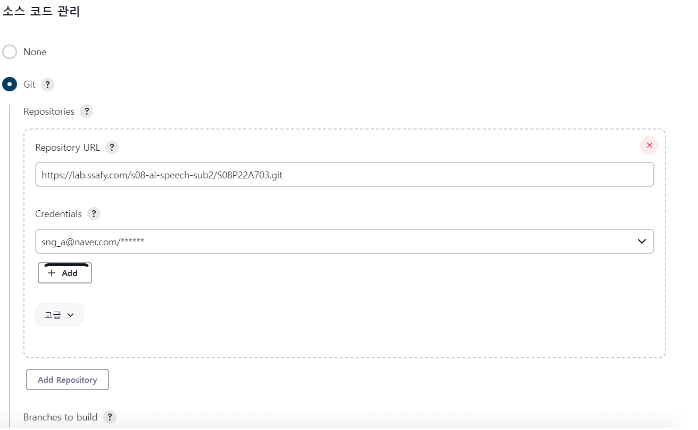

develop branch에 있는 프로젝트를 빌드

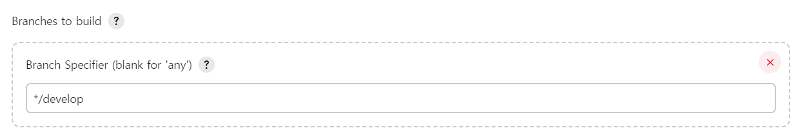

### Frontend - 빌드 유발

push 이벤트가 발생하면 빌드


고급설정

generation을 눌러서 secret token 발급 -> 이후 gitLab과 webhook 설정시 사용

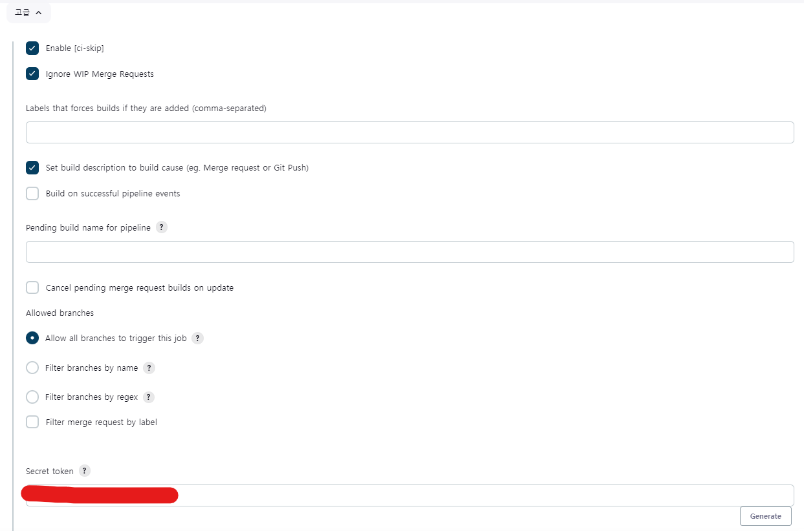

### Frontend - 빌드 환경

원하는 환경변수를 Credential에 등록하고 사용

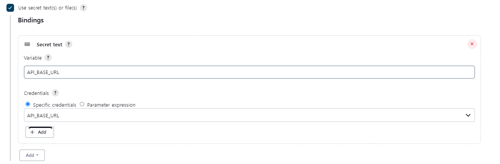

nodejs 관련 플러그인을 설치하면 보이는 option -> nodejs installations config 사용

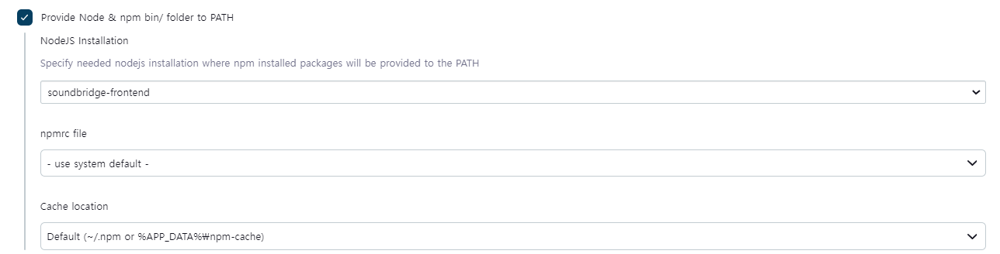

### Frontend - 빌드 스텝

node_module 설치


Dockerfile을 통해 frontend img 생성하는 command

여기서 ${WORKSPACE}란 root directory이다


이전 컨테이너를 지우는 command


front img로 container 실행하는 command

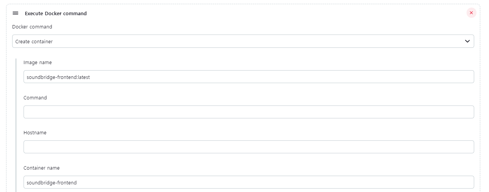

create의 고급옵션

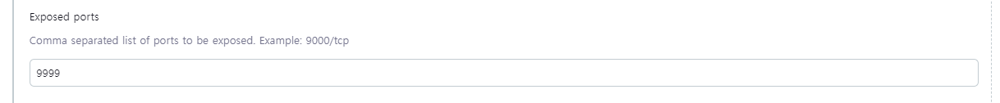

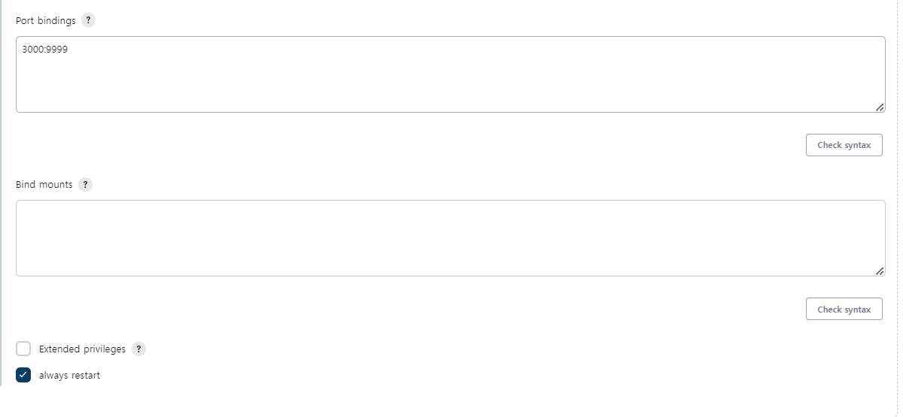컨테이너 실행 command


### Backend - 소스코드 관리

frontend와 동일


### Backend - 빌드 유발

front와 동일


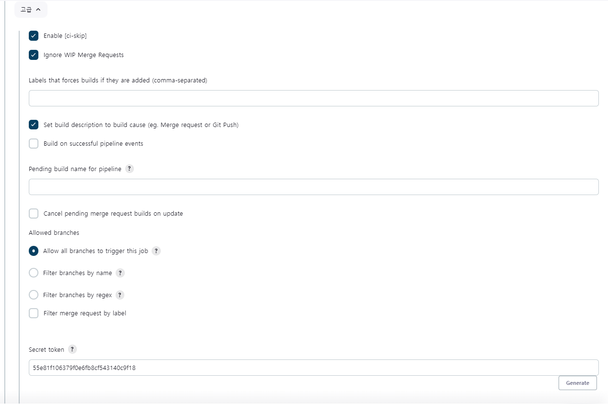

### Backend - 빌드환경

frontend와 동일하게 필요한 환경변수를 설정하면 된다.


### Backend - 빌드스텝

gradle을 사용하여 build. 위의 Gradle installations config를 활용하여 gradle 사용

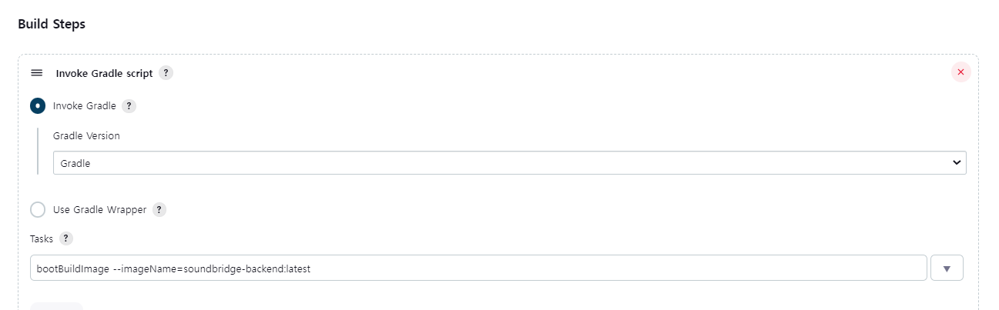

고급설정

build될 gradle파일의 경로를 등록한다

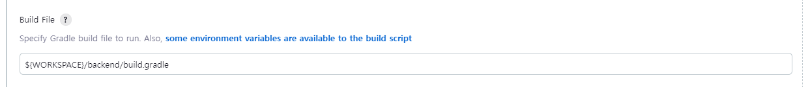

이전 container를 remove하는 command

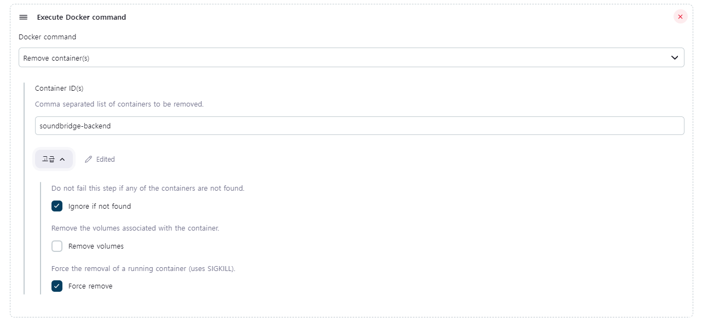

backend container를 생성하는 command


create 고급


backend container를 실행하는 command


여기까지 진행했다면 지금 빌드 버튼을 통해 빌드 테스트를 한다. 테스트에 통과했다면 gitLab과 webHook 설정을 한다

## 6. WebHooks

GitLab -> Setting -> Webhooks 이동

webhook이 필요한 jenkins의 아이템마다 설정해야한다.

URL에 [/project/jenkins의 아이템명] 을 꼭 붙어야 한다.

위에서 발급받은 Secret token들을 가져온다.

맨아래 SSL 설정한다.


## 7. OpenVidu

Openvidu 컨테이너 실행시키는 명령어

```
#YOUR_SECRET은 OpenVidu 컨트롤러에서 원하는 클라이언트가 OpenVidu 서버에 연결할 때 사용되는 비밀번호로 원하는 값으로 설정하면 된다
sudo docker run -p 4443:4443 -d -e OPENVIDU_SECRET=YOUR_SECRET openvidu/openvidu-server-kms
```

## 8. Redis

Docker에는 Redis 이미지가 별도로 존재

```
# redis 이미지를 받아옵니다.
sudo docker pull redis:alpine
```

Redis 네트워크 생성

```
sudo docker network create redis-network
```

Redis 네트워크 상세정보 확인

```
sudo docker inspect redis-network
```

Redis 컨테이너 실행

```
# local-redis라는 이름으로 로컬-docker 간 6379 포트 개방
# redis-network 이름의 네트워크를 사용,
# 로컬의 redis_temp와 도커의 /data를 서로 연결
# redis:alpine 이미지를 사용하여 백그라운드에서 실행
docker run --name local-redis -p 6379:6379 --network redis-network -v redis_temp:/data -d redis:alpine redis-server --appendonly yes
```

Backend Container를 Redis 네트워크에 넣기

```
sudo docker network connect redis-network a0e24dd0ab56
# host명을 local-redis로 설정

# 여기서 맨뒤에 backend 컨테이너 번호를 sudo docker ps를 활용하여 확인한다.
# Jenkins를 활용한 자동화는 아래 참고
```

Jenkins 자동빌드를 위한 Param 설정


Backend 컨테이너가 연결되면 컨테이너 번호를 받아서 네트워크 연결

