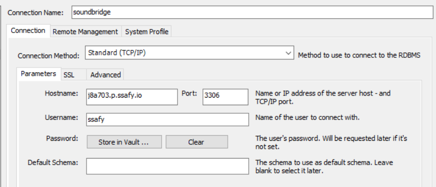
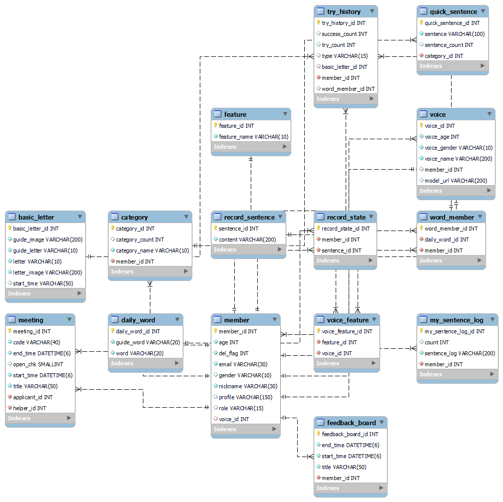
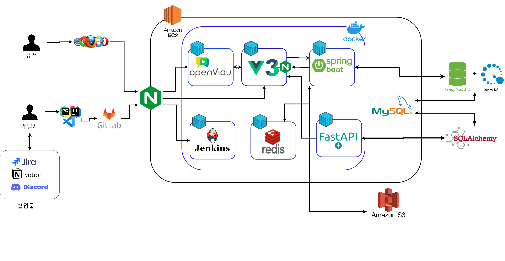

# 포팅 메뉴얼

### 버전

- 자바: java 11
- 파이썬:3.8.10
- vue: vue3
- springboot: v2.7.9
- node.js : 18.13.0
- vite : 4.1.4

### WAS

- AWS EC2 ubuntu
- S3

### DB 접속 정보

password=ssafy

### ERD

### Architecture

### 소셜인증 : 종민이 정리

### 빌드시 사용되는 환경변수

- Frontend:
  - API_BASE_URL={도메인 URL}
- Backend:
  - DATABASE_URL={자신의 DB URL}
  - DATABASE_ID={자신의 DB ID}
  - DATABASE_PASSWORD={자신의 DB PASSWORD}
  - BASE_URL={도메인 URL}
  - JWT_TOKEN_SECRET_KEY={JWT TOKEN의 SECRET KEY}
  - KAKAO_CLIENT_ID={KAKAO 소셜로그인을 위한 CLIENT ID}
  - KAKAO_REDIRECT_URL={KAKAO 소셜로그인을 위한 REDIRECT URL}
  - KAKAO_CLIENT_SECRET={KAKAO 소셜로그인을 위한 CLIENT SECRET KEY}
  - NAVER_CLIENT_ID={NAVER 소셜로그인을 위한 CLIENT ID}
  - NAVER_REDIRECT_URL={NAVER 소셜로그인을 위한 REDIRECT URL}
  - NAVER_CLIENT_SECRET={NAVER 소셜로그인을 위한 CLIENT SECRET KEY}
  - GOOGLE_CLIENT_ID={GOOGLE소셜로그인을 위한 CLIENT ID}
  - GOOGLE_REDIRECT_URL={GOOGLE 소셜로그인을 위한 REDIRECT URL}
  - GOOGLE_CLIENT_SECRET={GOOGLE 소셜로그인을 위한 CLIENT SECRET KEY}
  - LOGIN_SUCCESS_URL={LOGIN 성공시 accessToken 포함해서 보내는 URL}
  - OPENVIDU_SECRET={OPENVIDU PASSWORD}
  - OPENVIDU_URL={OPENVIDU URL}
- Python
  - DATABASE_URL={자신의 DB URL}
  - DATABASE_ID={자신의 DB ID}
  - DATABASE_PASSWORD={자신의 DB PASSWORD}
  - SERVER_ENV=production
  - MODEL_URL=/model
  - ACCESS_KEY={S3 ACCESS KEY}
  - SECRET_KEY={S3 SECRET KEY}
  - BUCKET={S3 BUCKET명}
  - CLIENT_ID={NAVER CLOVA CLIENT ID}
  - CLIENT_SECRET={NAVER CLOVA CLIENT SECRET KEY}

### 배포 시 특이사항

- 파이썬 배포시 학습된 모델을 ec2 ubuntu의 /home/ubuntu/workspace/model 에 올린다.
- 파이썬 컨테이너 실행 시 ec2 디렉토리를 연결해놔야 한다
  - /home/ubuntu/workspace/model:/model
- 배포 방법은 porting_menual_distribution.md 에 업로드
