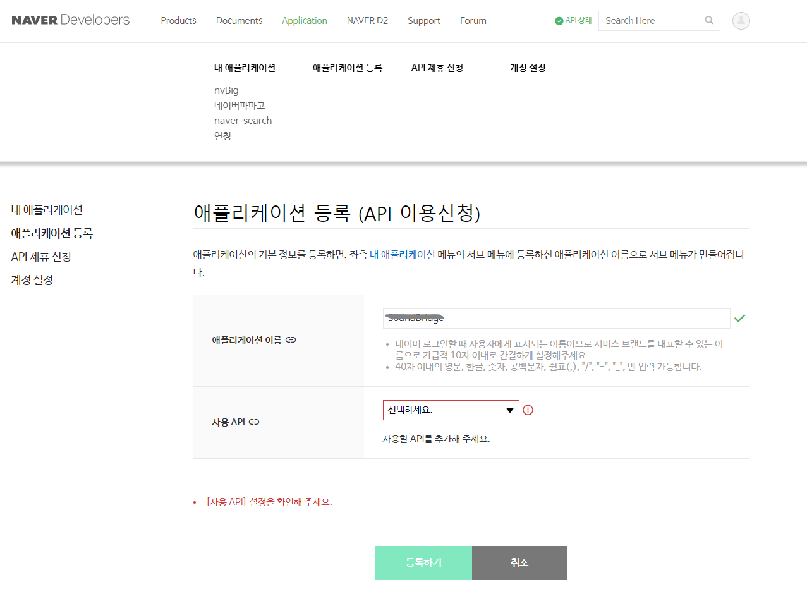
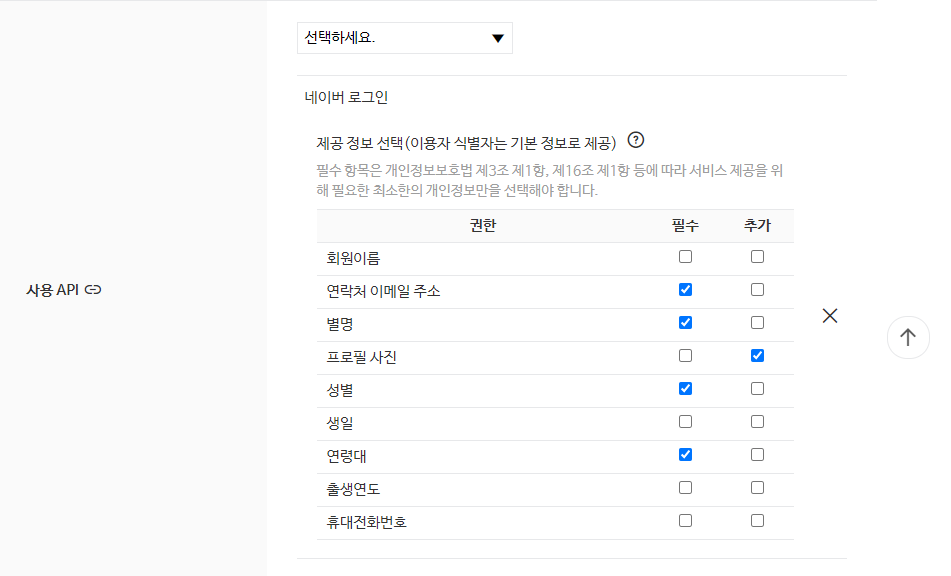
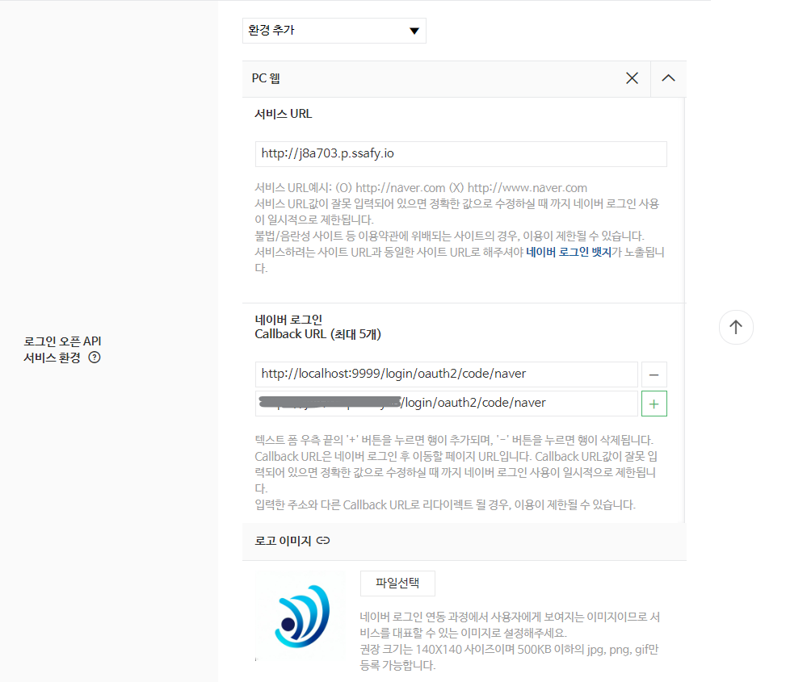
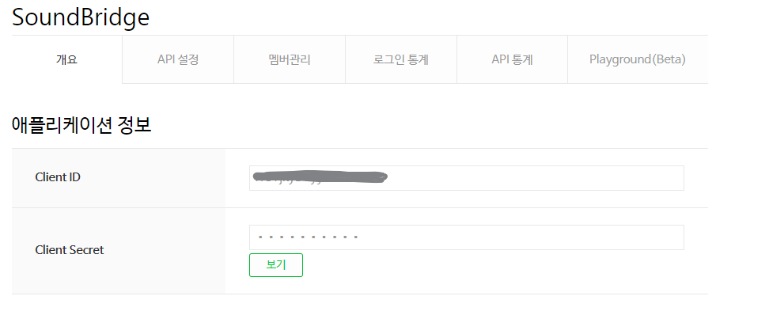
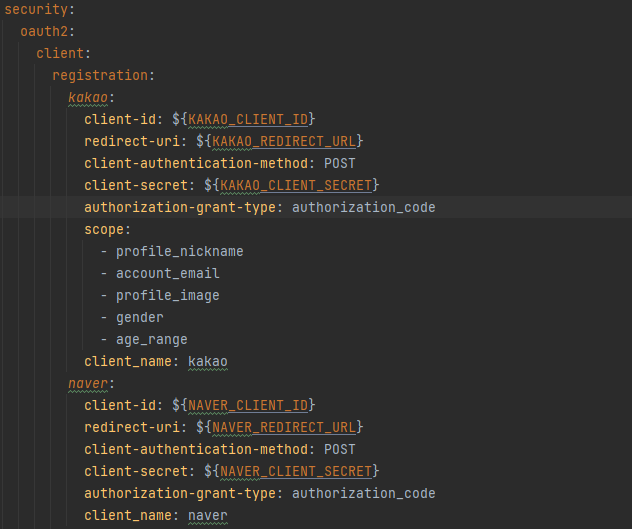
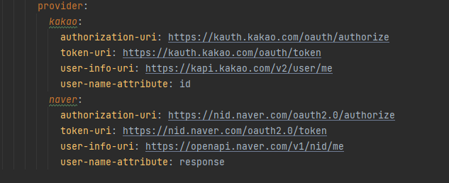

# Naver Login 설정

[https://developers.naver.com/apps/#/register](https://developers.naver.com/apps/#/register) 접속

애플리케이션 이름 및 사용할 API 선택 -> 네이버 로그인

제공 정보 선택

1. PC 웹으로 환경 추가
2. 서비스 URL 추가
3. callback URL 추가. domain뒤에 /login/oauth2/code/naver 필수 입력

클라이언트 ID와 Secret 확인

application.yml 에 naver api 정보 입력

